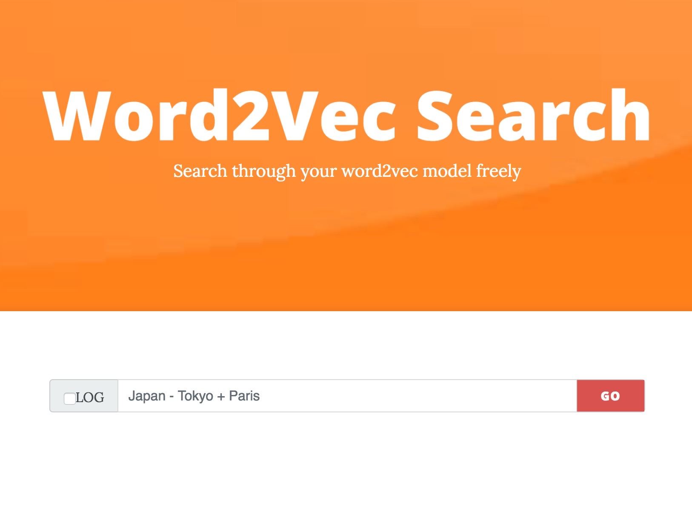
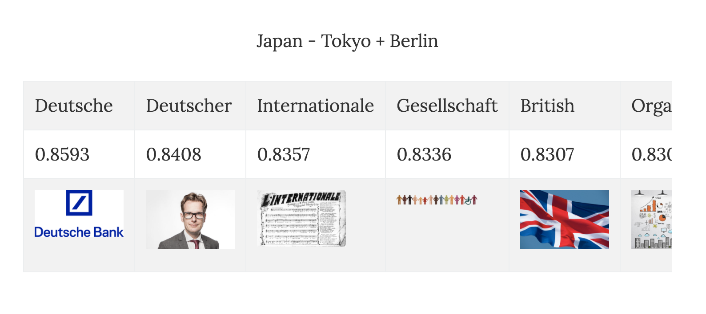

# word2vec-search-app

[](https://opensource.org/licenses/MIT)

A tornado based web application template used for web-based interaction with word2vec models trained using gensim/fasttext.
This web app is optimized for both desktop browsers and mobile browsers using booststrap library.

You can type the word you want to search in your word2vec model and press `GO` to find 10 most similar words to it. Simple arithmetic(+/-) of words is also supported. 

Note that the `+/-` operator you use must be *en* characters instead of *em* characters(Be careful when using models in languages that use *em* characters such as Chinese and Japanese).



Results are displayed with similarity scores and corresponding images like this:



The image search uses [getsy](https://github.com/epiqueras/getsy) as client-side web scraper.

If you check the `LOG` box in the left side of the search bar, search history will be stored at the bottom of the page.

## How to setup
First you need to clone this repository to your local disk:

```bash
git clone https://github.com/superkerokero/word2vec-search-app.git
```

Then you need to install the dependencies of the app:

```
pip install tornado gensim
```

Go to the directory of the app you have cloned, and edit `config.json` file in the root folder:

```json
{
    "model": "YOUR WORD2VEC MODEL FILE PATH",
    "fasttext": false,
    "debug": false
}
```

Change `model` to the string of your word2vec model path. 
If you are using a fasttext word2vec model, change `fasttext` to `true`. Note that model path for fasttext models should be `*.vec` file instead of `*.bin` file.

If you don't have your own word2vec model, please refer to section [Pre-trained-word2vec-models](#Pre-trained-word2vec-models) for downloading pre-trained word2vec models from the internet. 


If you need debugging, change `debug` to `true`.

Next open a terminal from the root folder, and use the following command to start the web server:

```bash
python server.py
```

You should see a message in the terminal indicating that your model is being loaded:

```
loading word2vec model...
```

After the loading is complete, you will see this message:

```
Word2vec model load complete.
```

Now you can open your browser and enter the following address to use the app.

```
http://localhost:8000
```


## Pre-trained-word2vec-models

There are many pre-trained word2vec models available from the internet.

For English word2vec models(from [3Top](https://github.com/3Top/word2vec-api)):


| Model file | Number of dimensions | Corpus (size)| Vocabulary size | Author | Architecture | Training Algorithm | Context window - size | Web page |
| --- | --- | --- | --- | --- | --- | --- | --- | --- |
| [Google News](https://drive.google.com/file/d/0B7XkCwpI5KDYNlNUTTlSS21pQmM/) | 300 |Google News (100B) | 3M | Google | word2vec | negative sampling | BoW - ~5| [link](http://code.google.com/p/word2vec/) |
| [Freebase IDs](https://docs.google.com/file/d/0B7XkCwpI5KDYaDBDQm1tZGNDRHc/edit?usp=sharing) | 1000 | Gooogle News (100B) | 1.4M | Google | word2vec, skip-gram | ? | BoW - ~10 | [link](http://code.google.com/p/word2vec/) |
| [Freebase names](https://docs.google.com/file/d/0B7XkCwpI5KDYeFdmcVltWkhtbmM/edit?usp=sharing) | 1000 | Gooogle News (100B) | 1.4M | Google | word2vec, skip-gram | ? | BoW - ~10 | [link](http://code.google.com/p/word2vec/) |
| [DBPedia vectors (wiki2vec)](https://github.com/idio/wiki2vec/raw/master/torrents/enwiki-gensim-word2vec-1000-nostem-10cbow.torrent) | 1000 | Wikipedia (?) | ? | Idio | word2vec | word2vec, skip-gram | BoW, 10 | [link](https://github.com/idio/wiki2vec#prebuilt-models) |

For other languages(from [Kyubyong](https://github.com/Kyubyong/wordvectors)):

| Language  |  ISO 639-1 | Vector Size | Corpus Size  | Vocabulary Size | 
| ---       |---        |---           |---           |---           |
|[Bengali (w)](https://drive.google.com/open?id=0B0ZXk88koS2KX01rR2dyRWpHNTA) \| [Bengali (f)](https://www.dropbox.com/s/xmi5xhqlu60bwfa/bn.tar.gz?dl=0)|bn|300|147M |10059| negative sampling |
|[Catalan (w)](https://drive.google.com/open?id=0B0ZXk88koS2KYkd5OVExR3o1V1k) \| [Catalan (f)](https://www.dropbox.com/s/pd59l1mwvg4hocp/ca.tar.gz?dl=0) |ca|300| 967M|50013| negative sampling |
|[Chinese (w)](https://drive.google.com/open?id=0B0ZXk88koS2KNER5UHNDY19pbzQ) \| [Chinese (f)](https://www.dropbox.com/s/il7syxqmnusul8c/zh.tar.gz?dl=0) |zh|300|1G |50101| negative sampling |
|[Danish (w)](https://drive.google.com/open?id=0B0ZXk88koS2KcW1aTGloZnpCMGM) \| [Danish (f)](https://www.dropbox.com/s/x2ekc79m8p6ycue/da.tar.gz?dl=0) |da|300| 295M|30134| negative sampling |
|[Dutch (w)](https://drive.google.com/open?id=0B0ZXk88koS2KQnNvcm9UUUxPVXc) \| [Dutch (f)](https://www.dropbox.com/s/8i6y29f38b7nb5s/nl.tar.gz?dl=0) |nl|300| 1G|50160| negative sampling |
|[Esperanto (w)](https://drive.google.com/open?id=0B0ZXk88koS2KblhZYmdReE9vMXM) \| [Esperanto (f)](https://www.dropbox.com/s/pomn7ozppq3xmi1/eo.tar.gz?dl=0) |eo|300|1G |50597| negative sampling |
|[Finnish (w)](https://drive.google.com/open?id=0B0ZXk88koS2KVnFyem4yQkxJUFk) \| [Finnish (f)](https://www.dropbox.com/s/ex0ne7rel49wtl2/fi.tar.gz?dl=0) |fi|300|467M |30029| negative sampling |
|[French (w)](https://drive.google.com/open?id=0B0ZXk88koS2KM0pVTktxdG15TkE) \| [French (f)](https://www.dropbox.com/s/iz3qo3cwbba0qfz/fr.tar.gz?dl=0) |fr|300|1G |50130| negative sampling |
|[German (w)](https://drive.google.com/open?id=0B0ZXk88koS2KLVVLRWt0a3VmbDg) \| [German (f)](https://www.dropbox.com/s/jy6taiacmptr537/de.tar.gz?dl=0) |de|300|1G |50006| negative sampling |
|[Hindi (w)](https://drive.google.com/open?id=0B0ZXk88koS2KZkhLLXJvbXVhbzQ) \| [Hindi (f)](https://www.dropbox.com/s/pq50ca4o3phi9ks/hi.tar.gz?dl=0) |hi|300|323M|30393|negative sampling |
|[Hungarian (w)](https://drive.google.com/open?id=0B0ZXk88koS2KX2xLamRlRDJ3N1U) \| [Hungarian (f)](https://www.dropbox.com/s/jtshcott8othxf2/hu.tar.gz?dl=0) |hu|300|692M |40122| negative sampling |
|[Indonesian (w)](https://drive.google.com/open?id=0B0ZXk88koS2KQWxEemNNUHhnTWc) \| [Indonesian (f)](https://www.dropbox.com/s/9vabe1vci7cnt57/id.tar.gz?dl=0) |id|300|402M |30048| negative sampling |
|[Italian (w)](https://drive.google.com/open?id=0B0ZXk88koS2KTlM3Qm1Ta2FBaTg) \| [Italian (f)](https://www.dropbox.com/s/orqfu6mb9cj9ewr/it.tar.gz?dl=0) |it|300|1G |50031| negative sampling |
|[Japanese (w)](https://drive.google.com/open?id=0B0ZXk88koS2KMzRjbnE4ZHJmcWM) \| [Japanese (f)](https://www.dropbox.com/s/7digqy9ag3b9xeu/ja.tar.gz?dl=0) |ja|300| 1G|50108| negative sampling |
|[Javanese (w)](https://drive.google.com/open?id=0B0ZXk88koS2KVVNDS0lqdGNOSGM) \| [Javanese (f)](https://www.dropbox.com/s/a9kmi5r7lr35kji/jv.tar.gz?dl=0) |jv|100|31M |10019| negative sampling |
|[Korean (w)](https://drive.google.com/open?id=0B0ZXk88koS2KbDhXdWg1Q2RydlU) \| [Korean (f)](https://www.dropbox.com/s/stt4y0zcp2c0iyb/ko.tar.gz?dl=0) |ko|200|339M|30185| negative sampling |
|[Malay (w)](https://drive.google.com/open?id=0B0ZXk88koS2KelpKdHktXzlNQzQ) \| [Malay (f)](https://www.dropbox.com/s/nl3ljdgxsgbsm6l/ms.tar.gz?dl=0) |ms|100|173M |10010| negative sampling |
|[Norwegian (w)](https://drive.google.com/open?id=0B0ZXk88koS2KOEZ4OThyS3gxZHM) \| [Norwegian (f)](https://www.dropbox.com/s/mag6beltx2q23aa/no.tar.gz?dl=0) |no|300|1G |50209| negative sampling |
|[Norwegian Nynorsk (w)](https://drive.google.com/open?id=0B0ZXk88koS2KOWdOYk5KaVhrX2c) \| [Norwegian Nynorsk (f)](https://www.dropbox.com/s/1qsywdv3zqybklm/nn.tar.gz?dl=0) |nn|100|114M |10036| negative sampling |
|[Polish (w)](https://drive.google.com/open?id=0B0ZXk88koS2KbFlmMy1PUHBSZ0E) \| [Polish (f)](https://www.dropbox.com/s/cibxhnsqk6gn1d8/pl.tar.gz?dl=0) |pl|300|1G |50035| negative sampling |
|[Portuguese (w)](https://drive.google.com/open?id=0B0ZXk88koS2KRDcwcV9IVWFTeUE) \| [Portuguese (f)](https://www.dropbox.com/s/nl7l8kqky0x94cv/pt.tar.gz?dl=0) |pt|300|1G |50246| negative sampling |
|[Russian (w)](https://drive.google.com/open?id=0B0ZXk88koS2KMUJxZ0w0WjRGdnc) \| [Russian (f)](https://www.dropbox.com/s/0x7oxso6x93efzj/ru.tar.gz?dl=0) |ru|300|1G |50102| negative sampling |
|[Spanish (w)](https://drive.google.com/open?id=0B0ZXk88koS2KNGNrTE4tVXRUZFU) \| [Spanish (f)](https://www.dropbox.com/s/irpirphmieg4klv/es.tar.gz?dl=0) |es|300|1G |50003| negative sampling |
|[Swahili (w)](https://drive.google.com/open?id=0B0ZXk88koS2Kcl90XzBYZ0lxMkE) \| [Swahili (f)](https://dl.dropboxusercontent.com/u/42868014/wordvectors/fasttext/models/sw.tar.gz) |sw|100|24M |10222| negative sampling |
|[Swedish (w)](https://drive.google.com/open?id=0B0ZXk88koS2KNk1odTJtNkUxcEk) \| [Swedish (f)](https://www.dropbox.com/s/7tbm0a0u31lvw25/sw.tar.gz?dl=0) |sv|300|1G |50052| negative sampling |
|[Tagalog (w)](https://drive.google.com/open?id=0B0ZXk88koS2KajRzX2VuYkVtYzQ) \| [Tagalog (f)](https://www.dropbox.com/s/4dm7k4sq43dqovx/tl.tar.gz?dl=0) |tl|100| 38M |10068|negative sampling |
|[Thai (w)](https://drive.google.com/open?id=0B0ZXk88koS2KV1FJN0xRX1FxaFE) \| [Thai (f)](https://www.dropbox.com/s/xj1ujw3es0umvzh/th.tar.gz?dl=0) |th|300|696M|30225| negative sampling |
|[Turkish (w)](https://drive.google.com/open?id=0B0ZXk88koS2KVDNLallXdlVQbUE) \| [Turkish (f)](https://www.dropbox.com/s/9v6h6mz3dv5xgsh/tr.tar.gz?dl=0) |tr|200|370M|30036|negative sampling |
|[Vietnamese (w)](https://drive.google.com/open?id=0B0ZXk88koS2KUHZZZkVwd1RoVmc) \| [Vietnamese (f)](https://www.dropbox.com/s/7de79czdc85pe8u/vi.tar.gz?dl=0) |vi|100|74M |10087| negative sampling |

